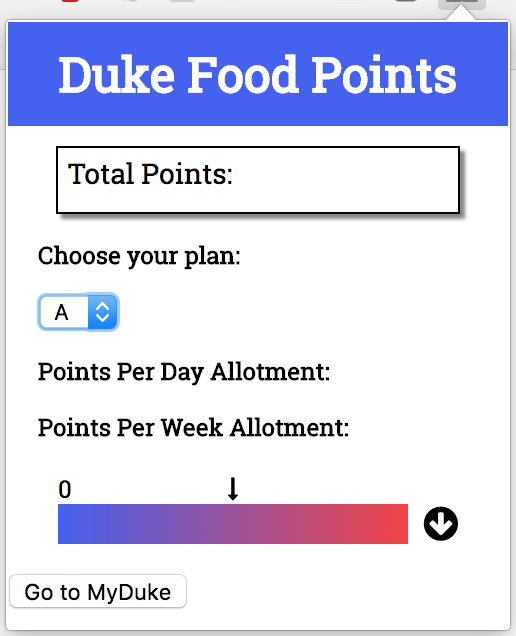

# Duke Food Points Chrome Extension

### Chrome extension made by Prathmesh Patel, Grant Kim, Nathan Lewis and Stephanie Shiyuan.

Currently scrapes food point information from my.duke.edu and performs calculations based off of the 2017-2018 school year calendar to provide detailed information about a students' food point balance. In addition to this a web app accessible through the chrome extension 'options' button allows the user to plan a weekly meal plan.

To build upon this plans to make it a web app and utlize Duke's OAuth system (with permission from the Co-Lab) to allow for login from anywhere making it available on more devices and more easily available.

